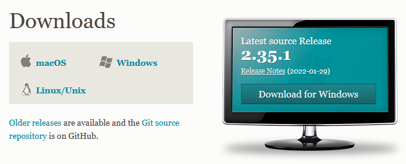
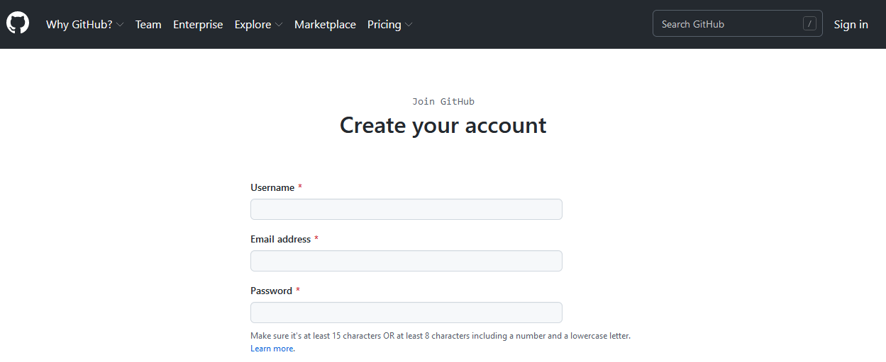

# What are Git and GitHub? {#Git2}

```{r tidyr2, echo = FALSE, message = FALSE, warning = FALSE}

library(knitr)
opts_chunk$set(tidy.opts=list(width.cutoff=50), tidy = FALSE)

``` 

Trying to find instructions on how to use git and GitHub online is notoriously difficult for beginners. You’ll often come across instructions like this:

> Doing X is easy. All you have to do is open up a terminal and type git -s -x -what -thehell -doesthisallevenmean

Thankfully using git and GitHub is super easy and you don’t have to use the command line at all to benefit from these tools. 

To get started, it is important to know what git and GitHub are and how they differ.

## Git {#Git2.1}

*Git* is software that (usually) runs on your computer. It is used to tracks all changes within a particular folder. Any change within that folder `--- a deleted file, a new line in a file, or a single changed letter in a single file ---` is tracked. It’s as if Microsoft word’s “Track Changes” function donned a cape, started solving crime, and kept meticulous notes all the while. 

A folder on your computer that is tracked by git is called a `repository` or `repo` for short. The only difference between a git repo and a regular folder on your computer is that a git repo has a folder within it named .git. It’s within this .git folder that all the changes in the main folder are tracked. Other than that, a git repo is just a folder on your computer like any other, but with new and wonderful powers. 

## GitHub {#Git2.2}

*GitHub* is an internet service that provides online cloud hosting for git repos, as well as useful tools for collaboration. You don’t have to have a GitHub account to use git, and you don’t even have to have git installed on your computer to use GitHub. But if you want a cloud backup, or if you want to sync your work to another computer, or especially if you want to collaborate or share your work with others (or copy their work!), you’ll want to use both git and GitHub.

> Git tracks all changes within a particular folder (aka git repo) on your computer 

> GitHub offers a way to backup or sync your git repos, or to collaborate with others

If you’re a fancy pants programmer you may want to use git from the command line (e.g., terminal or bash depending on your situation) so you can look cool, and admittedly have more fine-grained control over the process. But if you’re like the rest of us, and if you’re reading this document right now, you want a more user- and beginner-friendly option.

## Git to GitHub GUI {#Git2.3}

There are multiple graphical interfaces for using git and GitHub. This document will provide instructions for two methods: GitHub Desktop and RStudio. **Link to Chapters** 

Which option is for you? 

- If you are not actively developing R code, and just want/need to get existing files into GitHub, GitHub Desktop is the easiest method, with the least amount of configuration. 

- If you are actively writing analytical scripts, then using RStudio is recommend for you because there will be some additional instructions for using R Projects to best organize and annotate your R code.  

Keep in mind you can always use both to interact with your git repos.  

## Getting Started

Regardless of the GUI you select to use, there are a few steps you need to take to get started. 

First, get the software and account that you need:

1.	download and install git on your computer from here: https://git-scm.com/downloads

{-}
```{r coverimage, echo=FALSE, out.width="700px", fig.align='center'}

```

2.	sign up for a GitHub account here:
https://github.com/join 

{-}
```{r coverimage, echo=FALSE, out.width="700px", fig.align='center'}

```

Now you are ready to become a git master. Chapter 3 will get you started with GitHub Desktop and Chapter 4 will get you started with RStudio. Choose your own adventure! 


3.	download GitHub desktop from here: https://desktop.github.com/ 

Once everything is set up, log in to GitHub and create a new repository. You could in theory create just one repo and dump all your code in it. But you probably don’t have your code organized like that on your computer. Chances are you have your work organized (to some degree) in discreet folders that contain all the data and code relevant to a particular project. If so that’s great; you’ll make a new git repo for each local folder.


