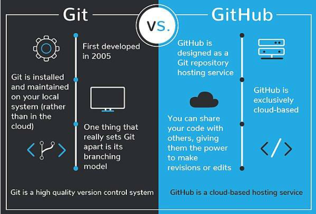
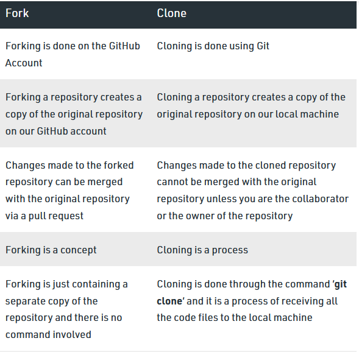

# What are Git and GitHub? {#Git2}

```{r tidyr2, echo = FALSE, message = FALSE, warning = FALSE}

library(knitr)
opts_chunk$set(tidy.opts=list(width.cutoff=50), tidy = FALSE)

``` 

Trying to find instructions on how to use git and GitHub online is notoriously difficult for beginners. You’ll often come across instructions like this:

> Doing X is easy. All you have to do is open up a terminal and type git -s -x -what -thehell -doesthisallevenmean

Thankfully, using git and GitHub is super easy and you don’t have to use the command line at all to benefit from these tools. 

To get started, it is important to know what git and GitHub are and how they differ.

{-}
```{r image, echo=FALSE, out.width="700px", fig.align='center'}

```
> Image credit: devmountian.com

## Git {#Git2.1}

*Git* is software that (usually) runs on your computer. It is used to tracks all changes within a particular folder. Any change within that folder `--- a deleted file, a new line in a file, or a single changed letter in a single file ---` is tracked. It’s as if Microsoft word’s “Track Changes” function donned a cape, started solving crime, and kept meticulous notes all the while. 

A folder on your computer that is tracked by git is called a `repository` or `repo` for short. The only difference between a git repo and a regular folder on your computer is that a git repo has a folder within it named .git. It’s within this .git folder that all the changes in the main folder are tracked. Other than that, a git repo is just a folder on your computer like any other, but with new and wonderful powers. 

## GitHub {#Git2.2}

*GitHub* is an internet service that provides online cloud hosting for git repos, as well as useful tools for collaboration. You don’t have to have a GitHub account to use git, and you don’t even have to have git installed on your computer to use GitHub. But if you want a cloud backup, or if you want to sync your work to another computer, or especially if you want to collaborate or share your work with others (or copy their work!), you’ll want to use both git and GitHub.

> Git tracks all changes within a particular folder (aka git repo) on your computer 

> GitHub offers a way to backup or sync your git repos, or to collaborate with others

If you’re a fancy pants programmer you may want to use git from the command line (e.g., terminal or bash depending on your situation) so you can look cool, and admittedly have more fine-grained control over the process. But if you’re like the rest of us, and if you’re reading this document right now, you want a more user- and beginner-friendly option.

## What else can GitHub do? {#Git2.3}

- Can be a cloud storage service for any type of file

- "Forking” allows people to use others’ projects as templates for their own

- Provides a hosting service for web content

- Allows you to freeze your work at a given moment in time as a "release" which can be linked to a DOI (Required by many journals/funders)

- Provides integration with other tools (e.g. OSF)

## Speaking git {#Git2.4}

Were you the kid that was tormented by your siblings speaking Pig Latin (also known as "Igpay Atinlay") and no matter how hard you tried, you couldn't figure it out. Learning to use git and Github can feel like learning a new language. But we promise it is easier than Pig Latin. 

When working with git and GitHub, you are going to see the words `push`, `pull`, `commit`, `clone`, `fork`, and `branch`. We will start with some basic definitions here, and in later chapters will elaborate on terms as necessary. 

Cloud - not to be confused with water vapors in the sky that manifest as big fluffy white objects. The cloud in the computer world is more abstract. For the purposes of this book, the cloud refers to GitHubs network of servers.  

Repo(sitory) - one or more folders that have git functionality. GitHub repos are initiated and stored on the cloud.  

Push - sends changes from your local repo to the cloud

Pull - gets changes from the cloud and updates your local repo

> Note: this is different from a `Pull request` which is when you want someone else to incorporate your changes into thier GitHub repo. More on this later.

Commit - create a named version of a set of one or more changes to a local repo, to be pushed to the cloud 

Now lets try some terms that will cause confusion: 

Clone - creates a copy of your GitHub repo on your local computer so that you can sync with the original repo. Note that if you clone a repo from someone else GitHub account, you cannot contribute to the repo unless you are a collaborator.Generally, you will make a folk for a collaborators repo.  

Fork - creates a copy of a repo in which changes are suppose to be made, which do not affect the original project. A connection is maintained between the fork of a repo and the original repo. Think of a folk as a bridge between the original repo and the local copy where changes can be made. After making and testing changes, you can contribute back to the original repo using a `Pull Request`. 

{-}
```{r image, echo=FALSE, out.width="700px", fig.align='center'}

```
> Image credit: geeksforgeeks.org

## Git to GitHub GUI {#Git2.5}

There are multiple graphical interfaces for using git and GitHub. This document will provide instructions for two methods: [GitHub Desktop](#Desk3) and [RStudio](#RStud4). **Link to Chapters** 

Which option is for you? 

- If you are not actively developing R code, or just need to get existing files into GitHub, GitHub Desktop is the easiest method, with the least amount of configuration. 

- If you are actively writing analytical scripts in R, then using RStudio is recommend for you because there will be some additional instructions for using R Projects to organize your workflow and annotate your R code.  

> You can use multiple git GUI at the same time without any issues so feel free to set up both.   

## Getting Started {#Git2.6}

Regardless of the GUI you select to use, there are a few steps you need to take to get started. 

First, get the software and account that you need:

1.	Download and install git on your computer from here: https://git-scm.com/downloads

{-}
```{r  image, echo=FALSE, out.width="700px", fig.align='center'}
knitr::include_graphics("images/Git1.PNG")
```

2.	Sign up for a GitHub account here:
https://github.com/join 

{-}
```{r  image, echo=FALSE, out.width="700px", fig.align='center'}
knitr::include_graphics("images/Git2.PNG")
```

Now you are ready to become a git master. [Chapter 3](#Desk3) will get you started with GitHub Desktop and [Chapter 4](#RStud4) will get you started with RStudio. 

Choose your own adventure! 


