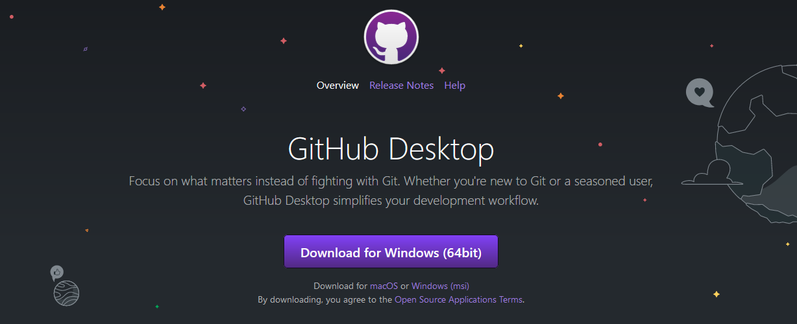
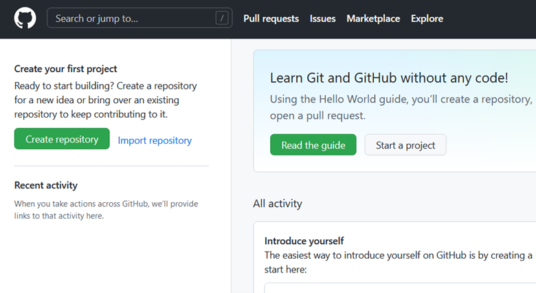
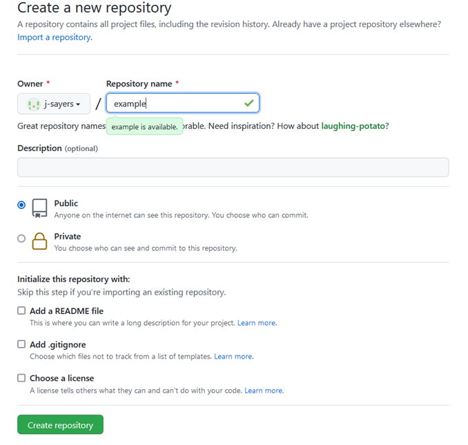
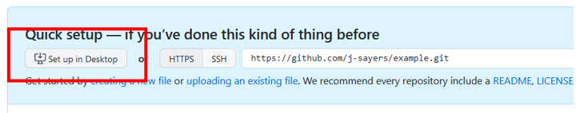
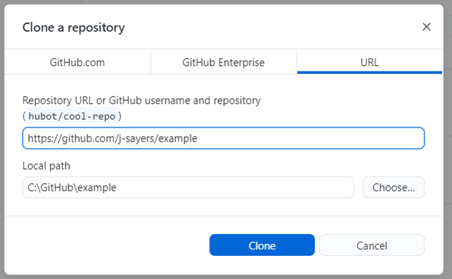
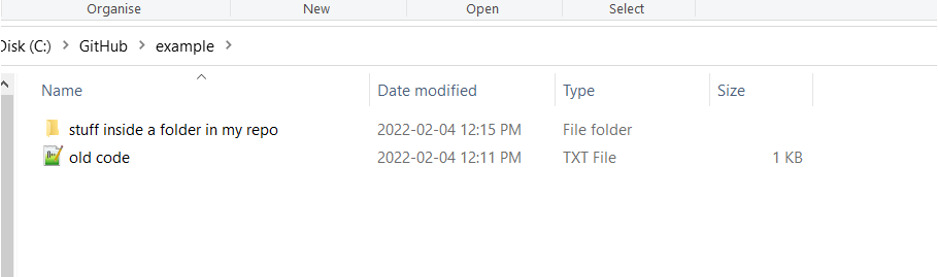
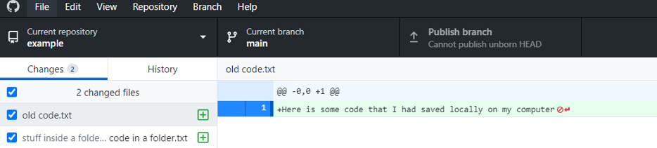
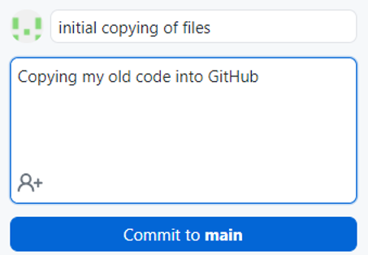

# Setup GitHub Desktop {#Desk3}

```{r tidyr3, echo = FALSE, message = FALSE, warning = FALSE}

library(knitr)
opts_chunk$set(tidy.opts=list(width.cutoff=50), tidy = FALSE)

``` 

You have chosen to download and setup Github Desktop. This is a great option if you are not actively coding, but have existing R script you want to move in bulk to GitHub. 

## Step 1: Download {#Desk3.1}

Download GitHub desktop from here: https://desktop.github.com/ 

```{r image5, echo=FALSE, out.width="700px", fig.align='center'}

```

## Step 2: Create New Repo {#Desk3.2}

Once everything is set up, log in to GitHub and create a new repository. You could in theory create just one repo and dump all your code in it, but you probably don’t have your code organized like that on your computer. Chances are you have your work organized (to some degree) in discreet folders that contain all the data and code relevant to a particular project. If so, that’s great; you’ll make a new .git repo for each project in your local folder.

```{r image6, echo=FALSE, out.width="700px", fig.align='center'}

```

> Recall: a .git repo is largely analogous to a folder on your computer. If you keep all code and data for a particular project in its own folder on your computer, give your new repo a name that reflects the project. 

```{r image7, echo=FALSE, out.width="700px", fig.align='center'}

```

You will notice a few option here when setting up your new repo. 

- Repository name (required): think short but concise.No spaces permitted. Also, each repo must have a unique name. 

- Public or Private repo: if you create a public repo, anyone on Github can see your work and seamless collaborate with you. A private repo can only be seen and accessed by you. You can add individual permissions to a Private repo to allow collaboration. And you can change the privacy setting at a later date.  

- Initialize this repository with: `README`, `.gitignore`, `license`: it is good practice to include all three of these files in your repo. 

`README` file can be used to add a short description of your project. 

`.gitignore` will have a drop down menu of templates. Select the template specific to R. This files tell .git which files types to ignore in the repo (i.e. they won't be backed up on the GitHub cloud storage). For example, the session data files `.RData` and history files `.Rhistory` will not be backed up. You may also be working with very large raw data files that are too big for GitHub to handle. These can be added to the `.gitignore` file. Example: you may want to add `.csv` to exclude raw data files. 

`Choose a license` will also have a drop down menu. It is wise to protect your intellectual property by assigning a license to your scripts and associated documents. This is not mandatory, but recommend. For most of our work, the GNU General Public License v3.0 is a good choice. You can learn more about your options [here](https://docs.github.com/en/repositories/managing-your-repositorys-settings-and-features/customizing-your-repository/licensing-a-repository). 

> Note: By creating the repo first in GitHub, and then cloning the repo to your computer, the repo on GitHub is the primary copy, referred to as the `origin`.
 

## Step 3: Set up Desktop {#Desk3.3}

Once you have selected `Create Repository` you’ll be brought to the next page with an option to `Set up in Desktop`. Click that and it will open up GitHub Desktop. You may need to log in to GitHub Desktop to authorize it.

```{r image8, echo=FALSE, out.width="700px", fig.align='center'}

```

In GitHub Desktop you’ll be prompted for where on your local computer you want to create this repository. This will create the repo (aka a folder) in your chosen location.

> Note: don’t choose a folder inside another cloud storage folder (e.g. OneDrive, Dropbox, Google Drive) as this can cause issues.

>Also note: a .git repo can only be created (aka initialized) in an empty folder. So if you are giving this repo the exact same name as the folder on your computer, and want to store it in the exact same place on your computer, you’ll need to rename your local folder first. Example: “My Project BACKUP”.

Click `clone` and the repo you just created in GitHub will be copied (cloned) onto your local computer to be tracked by .git. 

{-}
```{r image9, echo=FALSE, out.width="700px", fig.align='center'}

```

## Step 4: Copy files into your local .git repo {#Desk3.4}

You now have a .git repo on your computer. Now you are going to copy over your `.txt` `.R` or `.RMD` files as well as folders that contain any other important "stuff" (e.g., inputs, outputs, documents, ect). This is just like any other folder on your computer, except that any changes that occur inside the folder are tracked by .git and can be backed up on GitHub. 

Here is an example using an "old code.txt" file and a folder named "stuff inside a folder in my repo". 

```{r image10, echo=FALSE, out.width="700px", fig.align='center'}

```

.git keeps track of all changes inside a folder in near real-time, so almost as soon as you copy files into your new .git repo, you will see them reflected in GitHub Desktop. 

```{r image11, echo=FALSE, out.width="700px", fig.align='center'}

```

So far all you have done is observed changes inside the .git repo. But at this point git isn’t remembering any of these changes. For that to happen, you need to `commit` changes. This is a very important concept when working with git. When you commit changes, .git saves every detail about the current state of the folder at that moment. 

This is one of the most confusing things about git when you are just beginning because the word `commit` is both a verb and a noun. Once you commit (verb) the current state of your .git repo/folder it’s referred to as a commit (noun).

Really if we were being grammatically correct, we would probably refer to it as a commitment, or something like that. But as it stands, the word `commit` is used for both the process and the state. 

Every `commit` must be accompanied by a summary. It can be anything, but it’s helpful to make it short, clear, and descriptive so you know what changes are represented in that commit. Regardless of method used to interact with git --- GitHub Desktop, RStudio, command line --- you must always provide a summary when committing.

Here are a few examples to help you get started: 

- first commit of data analysis code

- major updates to analysis. GLM to GAM

- changes to trends plots

- fix broken web links

```{r image12, echo=FALSE, out.width="700px", fig.align='center'}

```

Now, click the blue button `Commit to main` to commit to your main, or primary, branch. 

> Recall: .git will not remember any changes unless you create a `commit`

## Step 5: Upload to GitHub {#Desk3.5}

Once you’ve committed to your local repo you can `push` these changes to GitHub. You should see another conveniently placed blue button labeled `push origin`. Once again, git’s grammatical shortcuts can create confusion; think of this as “push to origin”, origin being the primary copy of this repo (aka the one on GitHub).

> Normally you would ensure that you always `pull` before `pushing` so that any newer changes on the GitHub copy of the repo are compared and incorporated. GitHub has a handy feature where it regularly checks for updates on the GitHub repo and will prompt you to `pull` when needed.****

Now your files are tracked by Git and the copies of this repo on your computer and GitHub are in sync.

