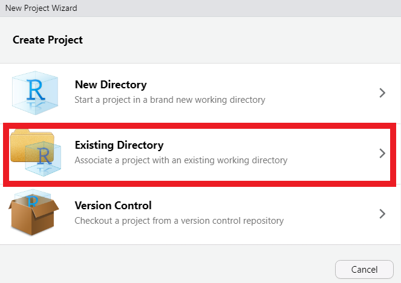

# Setup Git in RStudio {#RStud4}

```{r tidyr4, echo = FALSE, message = FALSE, warning = FALSE}

library(knitr)
opts_chunk$set(tidy.opts=list(width.cutoff=50), tidy = FALSE)

```

You have chosen to download and setup Git in RStudio. This is a great option if you are actively coding in R.

> **Note:** The following steps will setup new and empty repositories on GitHub and locally for your R projects. 
> If you already have an R project on the go, you will copy your scripts over to the new folder once you've finished setting things up.

## Step 1: Download {#RStud4.1}

The assumption is that you have downloaded and are familiar with [R](https://cran.r-project.org/bin/windows/base/) and [RStudio](https://www.rstudio.com/products/rstudio/download/), and that you are organizing your R work in [RStudio Projects](https://support.rstudio.com/hc/en-us/articles/200526207-Using-RStudio-Projects). 
(But if you secretly need to download and get yourself familiar with these programs, you can do that now!)

## Step 2: Create New Repo {#RStud4.2}

Once everything is set up, [log in to GitHub](#Git2.5) and create a new repository. You'll make a new Git repo for each RStudio Project folder.

```{r image13, echo=FALSE, out.width="700px", fig.align='center'}
knitr::include_graphics("images/Git4a.PNG")
```

```{r image14, echo=FALSE, out.width="700px", fig.align='center'}
knitr::include_graphics("images/Git5a.PNG")
```

You will notice a few option here when setting up your new repo.

-   Repository name (required): Think short but concise. No spaces permitted. Also, each repo must have a unique name.
This will also be the name of the R project folder on your computer.

-   Public or Private repo: if you create a public repo, anyone on Github can see your work and seamlessly collaborate with you. A private repo can only be seen and accessed by you. You can add individual permissions to a Private repo to allow collaboration. And you can change the privacy setting at a later date.

-   Initialize this repository with: `README`, `.gitignore`, `license`: it is good practice to include all three of these files in your repo.

`README` file can be used to add a short description of your project.

`.gitignore` will have a drop down menu of templates. Select the template specific to R. This files tell Git which files types to ignore in the repo (i.e. they won't be tracked or synced by Git). For example, the session data files `.RData` and history files `.Rhistory` will not be backed up. You may also be working with very large raw data files that are too big for GitHub to handle. These can be added to the `.gitignore` file.

`Choose a license` will also have a drop down menu. It is wise to protect your intellectual property by assigning a license to your scripts and associated documents. This is not mandatory, but recommend. For most of our work, the GNU General Public License v3.0 is a good choice. You can learn more about your options [here](https://docs.github.com/en/repositories/managing-your-repositorys-settings-and-features/customizing-your-repository/licensing-a-repository).


## Step 3: Configure RStudio {#RStud4.3}

Since you already have [Git installed on your computer](#Git2.4), simply open RStudio and go to `Tools` \> `Global Options`. Ensure that `Enable version control` is checked and that the Git executable is the proper path on your computer. There's a good chance this will already be populated. If not, it's probably in a very similar location on your computer as shown below.

```{r image15, echo=FALSE, out.width="700px", fig.align='center'}
knitr::include_graphics("images/Git11.PNG")
```

It is also best to change a few other settings in RStudio if you're working with Git, namely so that RStudio never saves the workspace. 
This keeps locally specific files that could give problems on other computers for other people, out of your Git repo, and is also much better practice for your own work as it ensures that you never accidentally carry over errors between work sessions.

```{r image16, echo=FALSE, out.width="700px", fig.align='center'}
knitr::include_graphics("images/Git12.PNG")
```

When working with Git in RStudio you must use `R Projects`. Each repo will be associated with a single `R Project`.

Q: What is an R Project?

A: An RStudio project file is a file that sits in the root directory, with the extension .Rproj.
This file tells RStudio that the folder is an R project folder and keeps track of any project-specific settings you use.
When you work with a project in RStudio, the working directory in R points to that project folder. 
Using absolute file paths and `setwd()` is no longer recommended as it makes it hard to create truly shareable and reproducible scripts.
It may seem like a radical move to abandon the `setwd()` orthodox entirely, but once you have figured out the R Project Workflow you'll never consider using absolute file paths again!

## Step 4: Clone the Repository from RStudio {#RStud4.4}

Now you will create a local clone of your Git repository from GitHub directly from RStudio. 
To achieve this, you'll need to copy the repo URL in GitHub

```{r image17, echo=FALSE, out.width="700px", fig.align='center'}

```

Then open RStudio and select `New Project` from the File menu, and then select `Version Control` -> `Git`. Now paste the URL you just copied from GitHub, and provide a local folder to store the repo.

> Note: don't choose a folder inside another cloud storage folder (e.g. OneDrive, Dropbox, Google Drive) for your local Git folders, as this can cause issues.

> Also note: a Git repo can only be created (aka initialized) in an empty folder. So if you are giving this repo the exact same name and location as an existing folder on your computer, you'll need to rename your original folder first. Example: "My Project" --> "My Project BACKUP".

```{r image18, echo=FALSE, out.width="700px", fig.align='center'}
knitr::include_graphics("images/Git14.PNG")
```

Awesome! You have just created a `clone` of the `origin` repo onto your local computer to be tracked by Git!

Now all of your interactions between Git and GitHub can happen through RStudio using the new `Git` tab, that will likely live alongside your Environment/History/etc tabs. 
The exact location will depend on how you have your RStudio configured.

```{r image19, echo=FALSE, out.width="700px", fig.align='center'}
knitr::include_graphics("images/Git15.PNG")
```

## Step 5: Stage, commit and push {#RStud4.5}

Now you are ready to start interacting with GitHub from RStudio.

Here are some very basic instructions to get you started. As you are going about your regular coding business working in an `R Project`, Git will be keeping track of the changes you make to the files in this repo. To move these changes from your local repo back to the `origin` on the cloud, there are four simple steps to follow: `stage`, `commit`, `pull`, and `push`.

Changes you make are not included in commits by default. 
To identify the changes you wish you commit, you `stage` them (think "add them to a staging area"). In the `Git` tab in RStudio, you will see check boxes under the word `staged`. 
Checking these boxes allows you to `stage` all changes in a file that you would like to commit to your local repo.
You can also click on the "Commit" button to choose specific changes within a file to stage, resulting in staging only parts of a file. 
Having such fine grained control over which changes to commit is certainly handy, but it's perfectly acceptable to just stage all changes on each commit.
If you have many modified files you can easily stage them all by selecting them all using `CTRL A` then clicking any of the check boxes.

```{r image20, echo=FALSE, out.width="700px", fig.align='center'}
knitr::include_graphics("images/Git17.PNG")
```

Now that you have `staged` your changes, we are going to `commit` to the local repo.

```{r image21, echo=FALSE, out.width="700px", fig.align='center'}

```

Every `commit` must be accompanied by a summary. It can be anything, but it's helpful to make it short, clear, and descriptive so you know what changes are represented in that commit. 
Regardless of the method used to interact with Git --- GitHub Desktop, RStudio, command line --- you must *always* provide a summary when committing.

Here are a few examples to help you get started:

-   "first commit of data analysis code"

-   "major updates to analysis. GLM to GAM"

-   "changes to trends plots"

-   "fix broken web links"

When you `commit` changes, Git saves every detail about the current state of the folder at that moment.

This is one of the most confusing things about Git when you are just beginning because the word `commit` is both a verb and a noun. Once you commit (verb) the current state of your Git repo/folder it's referred to as a commit (noun).

Really if we were being grammatically correct, we would probably refer to it as a commitment, or something like that. But as it stands, the word `commit` is used for both the process and the state.

```{r image22, echo=FALSE, out.width="700px", fig.align='center'}
knitr::include_graphics("images/Git19.PNG")
```

> Note: all Git repos are initialized first in GitHub, the cloud version is the primary copy, referred to as the `origin`.

If you only ever work from one computer, it's unlikely that the origin repo on GitHub will be ahead of your local repo. But if you are collaborating or if you work from multiple computers, making sure you regularly `pull` before `push` will help avoid conflicts in the code, so it's good practice to get into. Once you've committed to your local repo, and pulled the latest updates from the origin repo (on GitHub), you can `push` these changes to GitHub.

```{r image23, echo=FALSE, out.width="700px", fig.align='center'}
knitr::include_graphics("images/Git20.PNG")
```

Now the local and GitHub clones of this repo are in sync.

## Step 6: Link RStudio to existing local .git repo {#RStud4.6}

If you have a .git repo on your computer that you created with GitHub Desktop, for example, you can link this to RStudio. First, create a `New Project` from the File menu in RStudio and select `Existing Directory`. Then navigate to your .git repo (aka folder). Select it and RStudio will base the new project out of this folder. RStudio will recognize that this folder is a .git repo and it will set it up the project appropriately.

```{r image24, echo=FALSE, out.width="700px", fig.align='center'}

```

