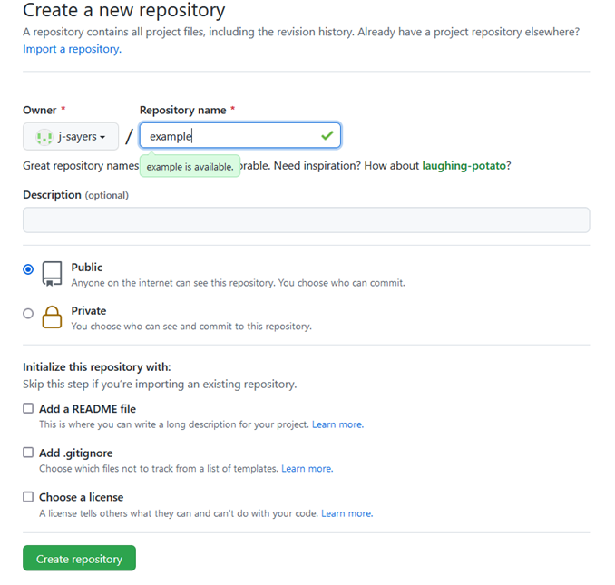

# Working with Git in RStudio {#RStud4}

```{r tidyr4, echo = FALSE, message = FALSE, warning = FALSE}

library(knitr)
opts_chunk$set(tidy.opts=list(width.cutoff=50), tidy = FALSE)

``` 

You have chose to download and setup git in RStudio. This is a great option if you are actively coding.  

## Step 1: Download {#RStud4.1}

The assumption was made that you have downloaded and are familiar with [R](https://cran.r-project.org/bin/windows/base/) and [RStudio](https://www.rstudio.com/products/rstudio/download/). But if you secretly need to download and get yourself familiar with these program, you can do that now.  

##Step 2: Create New Repo {#RStud4.2}

Once everything is set up, log in to GitHub and create a new repository. You’ll make a new git repo for each R Project.

{-}
```{r  image, echo=FALSE, out.width="700px", fig.align='center'}
knitr::include_graphics("images/Git4.PNG")
```

> Recall that a git repo is largely analogous to a folder on your computer. If you keep all code and data for a particular project in its own folder on your computer, give this new repo a name that reflects the project. 

{-}
```{r  image, echo=FALSE, out.width="700px", fig.align='center'}

```

You will notice a few option here when setting up your new repo. 

- Repository name (required): Think short but concise.No spaces permitted. Also, each repo must have a unique name. 

- Public or Private Repo: if you create a public repo, anyone on Github can see your work and seamless collaborate with you. A private repo can only be seen and accessed by you. You can add individual permissions to a Private repo. And you can change the privacy setting at a later date.  

- Initialize this repository with: `README`, `.gitignore`, `license`. It is good practice to include all three of these files in your repos. 

~~~
`README` file can be used to add a short description of your project. 

`.gitignore` will have a drop down menu of templates. Select the template specific to R. This files tell .git which files types to ignore in the repo (i.e. they won't be backed up on the GitHub cloud storage). For example, the session data files `.RData` and history files `.Rhistory` will not be backed up. You may also be working with very large raw data files that are too big for GitHub to handle. These should be added to the `.gitignore` file. Example: you may want to add `.csv` to exclude raw data files. 

`Choose a license` will also have a drop down menu. It is wise to protect your intellectual property by assigning a license to your scripts and associated documents. This is not mandatory, but recommend. For most of our work, the GNU General Public License v3.0 is a good choice. You can learn more about your options [here](https://docs.github.com/en/repositories/managing-your-repositorys-settings-and-features/customizing-your-repository/licensing-a-repository). 
~~~


## Step 1: Configure RStudio {#RStud4.1}

Since you already have [git installed on your computer](#Git2.4), simply open RStudio and go to `Tools` > `Global Options`. Ensure that `Enable version control` is checked and that the Git executable is the proper path on your computer. There’s a good chance this will already be populated. If not, it’s probably in a very similar location on your computer as shown below. 

{-}
```{r image, echo=FALSE, out.width="700px", fig.align='center'}
knitr::include_graphics("images/Git11.PNG")
```

It is also best to change a few other settings in RStudio if you’re working with git, namely so that RStudio never saves the workspace. This keeps locally specific files that could give problems on other computers for other people, out of your git repo.

{-}
```{r image, echo=FALSE, out.width="700px", fig.align='center'}
knitr::include_graphics("images/Git12.PNG")
```

> When working with git in RStudio you must use `Projects`. This is good practice anyway since an RStudio project is basically just a folder that contains all the data and code for a particular project. More on RStudio Projects in Chapter X. 

# Initializing a git repo from RStudio 

You can also initialize your local git repo directly from RSudio if you don’t already have it on your computer. For that, you’ll need to copy the  repo URL in GitHub


# Link RStudio to exisiting git repo

Create a new project in RStudio and select Existing Directory. Then navigate to your git repo aka folder. Select it and RStudio will base the new project out of this folder. RStudio will recognize that this folder is a git repo and it will set it up the project appropriately.
