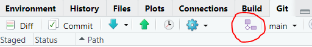

# GitHub Best Practices {#Best5}

Now that you have a GitHub account and are set up on GitHub Desktop or RStudio, we will bestow upon you some additional best practices.

## Use a unique repository for each project {#Best5.1}

You can host multiple projects on GitHub at the same time but it would be a mistake to use one repository to store information about multiple projects. Make sure you maintain a unique repository for each project. Like folders on your computer, this will keep your code organized and your brain happy.

## Use branches to avoid heartache {#Best5.2}

A `branch` is a way to develop scripts (e.g., a new feature or modification) alongside functions scripts, while not affecting the original (i.e., the main or default branch). It is good practice to work on short-lived branches.If you are working on developing new code, you will probably work from a single branch, called the main or default branch, and commit changes as you go to the origin on Github. But once you have a functional amount of code, or are collaborating on code development, you will want to create a `branch` so that you are not risking breaking what is already working!

-   Create a branch: This is the first step in the process, you create a new branch for the development using the symbol (next to the current branch name).

-   Name your branch: give your branch a meaningful names that is all lower case with no spaces. Then check the box `Sync branch with remote` and then `Create`. This is now called the feature or topic branch.

-   Create changes: now make the edits was want to you script within the branch.

-   Merge a branch: Once you're satisfied with your work, you can open a pull request to merge the changes with the main branch. Click `push` to make the request. Not navigate to your Github repository (online) and create a `pull request`

Github will suggest you `Compare & Pull request` (look for the yellow box). The `pull request` aims to insert the adaptations in your branch to the main branch.If you are working on your own repo you can merge the `pull requests` yourself.

-   Delete branch: once complete, you can delete the old branch. Github will prompt you to do this.

In order to remain popular with your peers, keep these consideration in mind when working with branches:

-   Never merge locally to your machine. Always merge branches online by making a `pull request`.

-   Always `commit` into a feature/ topic branch, never to the master branch.

-   Always start a new branches from the main branch.

-   Only work on your own branches.

-   Never merge someone else's pull request without their consent.

-   Branches should be short-lived

## Create a meaningful .gitignore file {#Best5.3}

.gitignore files are plain text files that instruct the program on predefined files that should be ignored.

Specifically, Github has a file size limit. It is therefore best suited to storing your R scripts and other related files (e.g., ReadMe), **but not raw data and large output files**. These files should be save elsewhere on your computer and *backed up* on your cloud storage.

Recall that during the creation of your first `repo` we selected the R .gitignore file template, which will be saved in your root folder. You can open this file in RStudio and add or remove any file types.

For example:

.pfd .csv .xlsx

## Define the code owner {#Best5.4}

It is important that you give yourself credit for the code you create, and likewise give others credit for the code they created. If you borrow or modified code from another source, this is OK! Just make sure you give credit where credit is due. Similarly, if you are collaborating on code development, define the roles of each author. This can be done at the front end of your scripts and interspersed within the script.

GitHub has a built-in code owners feature that allows you to grant access to a particular group of staff or partners. Only verified code owners will be able to edit or review the project. The code owner feature can be used for more than assigning individuals to work on the repository. It can automatically assign teams and grant them permission to work on the project and maintain the repository. Birds Canada will be using the team and code owner feature to manage scripts that are shared. See Chapter 5.

## Don't let your password leak into your code {#Best5.5}

While it seems obvious that you should not share your password, you might accidentally save this in your source code and `commit` it to Github. For example, when downloading data from NatureCounts using the R package, you might be inclined to save your username and password in your source code. Ensure this isn't the case before you `commit`!

## Don't commit an crime {#Best5.6}

Make small commits and make them often. Each commit should reflect changes that are easily accompanied by a single and informative commit message. For example:

> Change made to analysis model fit code

You should try to refrain from making a lot of changes to a lot of sections of your code making a mixed-commit. For example:

> Major changes to analysis, data manip, and bookdown yml.

If you need to revert any files, you will be happy up made consistent and well detailed commits.
