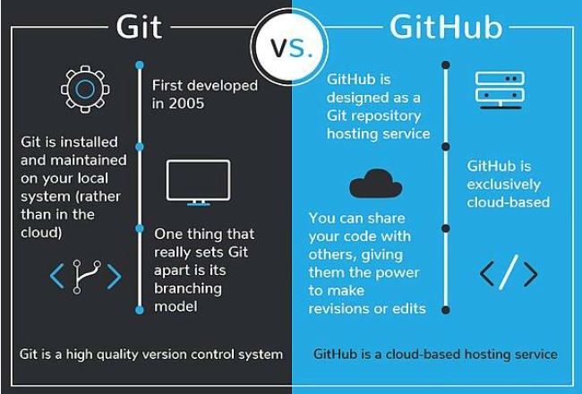
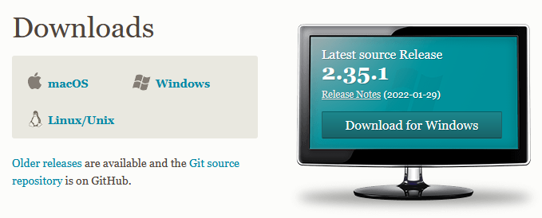

# What are Git and GitHub? {#Git2}

Trying to find instructions on how to use git and GitHub online is notoriously difficult for beginners. You’ll often come across instructions like this:

> Doing X is easy. All you have to do is open up a terminal and type git -s -x -what -thehell -doesthisallevenmean

Thankfully, using git and GitHub is super easy and you don’t have to use the command line at all to benefit from these tools. 

To get started, it is important to know what git and GitHub are and how they differ.

Image credit: devmountian.com

## Git {#Git2.1}

*Git* is software that (usually) runs on your computer. It is used to tracks all changes within a particular folder. Any change within that folder --- a deleted file, a new line in a file, or a single changed letter in a single file --- is tracked. It’s as if Microsoft word’s “Track Changes” function donned a cape, started solving crime, and kept meticulous notes all the while. 

A folder on your computer that is tracked by .git is called a `repository` or `repo` for short. The main difference between a .git repo and a regular folder on your computer is that a git repo has a folder within it named .git. It’s within this .git folder that all the changes in the main folder are tracked. Other than that, a git repo is just a folder on your computer like any other, but with new and wonderful powers. 

## GitHub {#Git2.2}

*GitHub* is an internet service that provides online cloud hosting for .git repos, as well as useful tools for sharing and collaboration. You don’t have to have a GitHub account to use .git, and you don’t even have to have git installed on your computer to use GitHub. But if you want a cloud backup, want to sync your work to multiple computer, or especially if you want to collaborate or share your work with others (or copy their work!), you’ll want to use both .git and GitHub.

> .git tracks all changes within a particular folder (aka git repo) on your computer 

> GitHub offers a way to backup or sync your .git repos, or to collaborate with others

If you’re a fancy pants programmer you may want to use git from the command line (e.g., terminal or bash depending on your situation) so you can look cool, and admittedly have more fine-grained control over the process. But if you’re like the rest of us, and if you’re reading this document right now, you want a more user- and beginner-friendly option.

Image credit: devmountain.com

## .git the language {#Git2.3}

Were you the kid that was tormented by your siblings speaking Pig Latin (also known as "Igpay Atinlay") and no matter how hard you tried, you couldn't figure it out. Learning to use .git and Github can feel like learning a new language. But we promise it is easier than Pig Latin. 

When working with .git and GitHub, you are going to see the words `repo`, `origin`, `commit`, `push`, `pull`, `clone`, `fork`, and `branch`, among others. We will start with some basic definitions here, and in later chapters will elaborate on terms as necessary. 

**repo(sitory)** - a folder whose contents are is tracked by Git. A repo can exist locally (on your computer) as a remote repository (on GitHub), or both.

**origin** - the primary .git repo, against which other copies are compared. In our examples, we will create the origin repo in GitHub

**Push** - sends changes from your local .git repo to the remote reposotiry (e.g. GitHub)

**Pull** - gets changes from the cloud and updates your local .git repo

> Note: this is different from a `pull request` which is when you want someone else to incorporate your changes into their GitHub repo. More on this later.

**commit** - create a named version of a set of one or more changes to a local .git repo, to be pushed to the cloud. Also used to refer to this named state. In other words, when you commit your changes, you create a commit.

**clone** - creates a copy of a git repo. In our examples you the repos will first be created in GitHub (i.e., origin) and then cloned to your local .git repo on your computer.

> Note: if you clone a repo from someone else GitHub account, you cannot contribute to the repo unless. Generally, you will make a `fork` if you are working collaboratively on a repo.  

**fork** - creates a copy of a repo which maintained a connection between your local repo and the origin repo. Think of a folk as a bridge between the original repo and the local copy where changes can be made. After making and testing changes, you can contribute back to the original repo using a `pull request`. 

**branch** - is a new/separate version of the main repo. It is a way to develop new or modification to your R scripts, while not affecting the main part of the project. It is a feature in most version control systems. 

> Note: the primary or default branch in Git is the `master branch` (sometimes referred to as `main` branch). Think of the master branch as the trunk of the tree. Every repo contains at minimum this one branch, which is created when the repo is initialized.

## .git to GitHub GUI {#Git2.4}

There are multiple graphical interfaces for using .git and GitHub. This document will provide instructions for two methods: [GitHub Desktop](#Desk3) and [RStudio](#RStud4). 

Q: Which option is for you? 

A: It depends. GitHub Desktop and RStudio offer different advantages. Which is for you will largely depend on how you plan to use and interact with GitHub.  

- If you are not actively developing R code, and/or just need to get existing files into GitHub, GitHub Desktop is the easiest method, with the least amount of configuration. 

- If you are actively writing analytical scripts in R, then using RStudio is recommend because there will be some additional instructions for using `R Projects` to organize your workflow and annotate your code.  

You can use multiple .git GUI at the same time without any issues so feel free to set up and get familiar with both.  

## Getting Started {#Git2.5}

Regardless of the GUI you select to use, there are a few steps you need to take to get started. 

First, get the software and account that you need:

1.	Download and install git on your computer from here: https://git-scm.com/downloads

2.	Sign up for a GitHub account here:
https://github.com/join 

Now you are ready to become a git master. [Chapter 3](#Desk3) will get you started with GitHub Desktop and [Chapter 4](#RStud4) will get you started with RStudio. 

Some elements of these Chapter are repetitive so that users can choose one or the other. If you choose to go with both, then skim over the repetitive parts. 

Choose your own adventure! 

