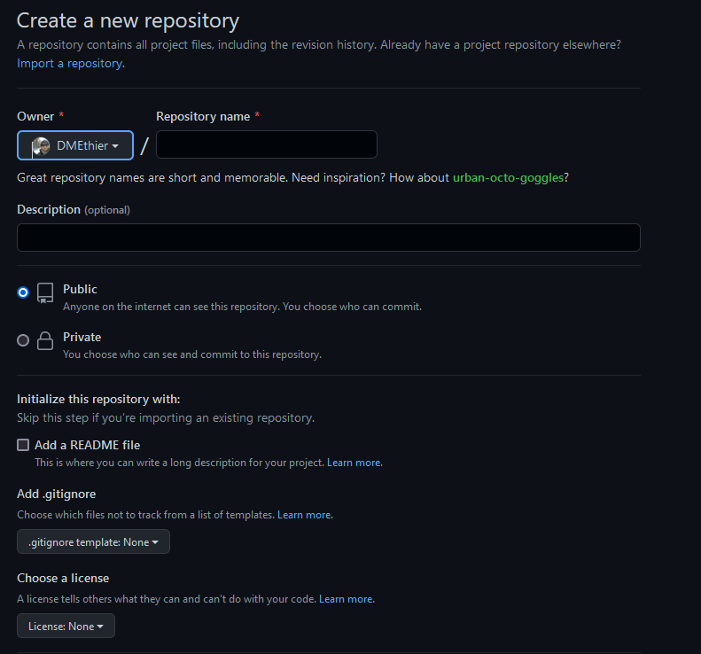

# Working with Git in RStudio {#RStud4}

You have chose to download and setup git in RStudio. This is a great option if you are actively coding.  

## Step 1: Download {#RStud4.1}

The assumption was made that you have downloaded and are familiar with [R](https://cran.r-project.org/bin/windows/base/) and [RStudio](https://www.rstudio.com/products/rstudio/download/). But if you secretly need to download and get yourself familiar with these program, you can do that now.  

##Step 2: Create New Repo {#RStud4.2}

> Recall: all .git repos that are backup on the cloud are initilized from Github. This is refered to the `origin` repo. 

Once everything is set up, log in to GitHub and create a new repository. You’ll make a new .git repo for each R Project.

{-}

{-}

You will notice a few option here when setting up your new repo. 

- Repository name (required): Think short but concise.No spaces permitted. Also, each repo must have a unique name. 

- Public or Private repo: if you create a public repo, anyone on Github can see your work and seamless collaborate with you. A private repo can only be seen and accessed by you. You can add individual permissions to a Private repo to allow collaboration. And you can change the privacy setting at a later date.  

- Initialize this repository with: `README`, `.gitignore`, `license`: it is good practice to include all three of these files in your repo. 

~~~
`README` file can be used to add a short description of your project. 

`.gitignore` will have a drop down menu of templates. Select the template specific to R. This files tell .git which files types to ignore in the repo (i.e. they won't be backed up on the GitHub cloud storage). For example, the session data files `.RData` and history files `.Rhistory` will not be backed up. You may also be working with very large raw data files that are too big for GitHub to handle. These can be added to the `.gitignore` file. Example: you may want to add `.csv` to exclude raw data files. 

`Choose a license` will also have a drop down menu. It is wise to protect your intellectual property by assigning a license to your scripts and associated documents. This is not mandatory, but recommend. For most of our work, the GNU General Public License v3.0 is a good choice. You can learn more about your options [here](https://docs.github.com/en/repositories/managing-your-repositorys-settings-and-features/customizing-your-repository/licensing-a-repository). 
~~~

## Step 3: Configure RStudio {#RStud4.3}

Since you already have [.git installed on your computer](#Git2.4), simply open RStudio and go to `Tools` > `Global Options`. Ensure that `Enable version control` is checked and that the Git executable is the proper path on your computer. There’s a good chance this will already be populated. If not, it’s probably in a very similar location on your computer as shown below. 

{-}

It is also best to change a few other settings in RStudio if you’re working with .git, namely so that RStudio never saves the workspace. This keeps locally specific files that could give problems on other computers for other people, out of your git repo.

{-}

> Note: when working with .git in RStudio you must use `R Projects`. Each repo will be associated with a single `R Project`.  

Q: What is an R Project? 
A: An RStudio project file is a file that sits in the root directory, with the extension .Rproj. When your RStudio session is running through the project file (.Rproj), the current working directory points to the root folder where that .Rproj file is saved. It may seem like a radical move to abandon the `setwd()`orthodox entirely, but once you have figured out the [R Project Workflow](Chapter X link) you'll never consider using absolute file paths again! This is also fundamental aspect of creating shareable and reproducible scripts. 

## Step 4: Initializing a .git repo from RStudio {#RStud4.4}

Now you will initialize your local .git repo directly from RStudio. To achieve this, you’ll need to copy the repo URL in GitHub

{-}

Then open RStudio and select `New Project` from the File menu, and then select `Version Control` > `Git`. Now paste the URL you just copied from GitHub, and provide a local folder to store the repo. 

> Note: don’t choose a folder inside another cloud storage folder (e.g. OneDrive, Dropbox, Google Drive) for your local .git folders, as this can cause issues.

{-}

You have just created a `clone` of the `origin` repo onto your local computer to be tracked by .git. 

Now all of your interactions between .git and GitHub can happen through RStudio using the new `Git` tab, that will likely live alongside you Environments/History/File/Plots, ect. The exact location will depend on how you have your RStudio configured. 

{-}

## Step 5: Link RStudio to exisiting local .git repo {#RStud4.5}

If you have a .git repo on your computer that you created with GitHub Desktop, for example, you can link this to RStudio. First, create a `New Project` from the File menu in RStudio and select `Existing Directory`. Then navigate to your .git repo (aka folder). Select it and RStudio will base the new project out of this folder. RStudio will recognize that this folder is a .git repo and it will set it up the project appropriately.

{-}

