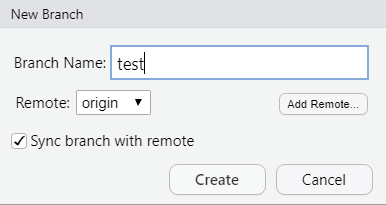
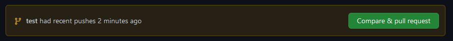
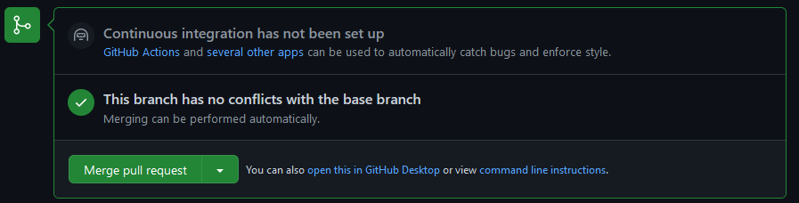
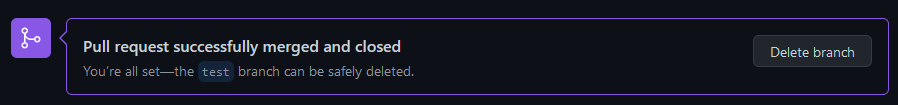

# GitHub Branch {#Branch5}

A `branch` is a way work on alternative versions of your scripts (e.g., a new feature or modification), while not affecting the original (i.e., the main or default branch). It is good practice to work on short-lived branches, so that merging is easier. If you are working on developing new code, you will probably work from a single branch, called the main or default branch, and commit changes as you go to the origin on GitHub. But once you are making changes to established code, or are collaborating on code development, you will want to create a separate `branch` to work on so that you are not risking breaking what is already working!

Here are some steps to get you started. We only provide instructions for RStudio because we assume if you are actively coding you are using RStudio.

## Step 1: Create a branch {#Branch5.1}

Create a new branch using the symbol next to the current branch name.

## Step 2: Name your branch {#Branch5.2}

Give your branch a meaningful name that is all lower case with no spaces. Then check the box `Sync branch with remote` and then `Create`. This is now called the feature or topic branch.

## Step 3: Make changes {#Branch5.3}

Edit the script as you want within the branch using RStudio. This is when you can break what is working and test new ideas.

## Step 4: Push changes {#Branch5.4}

Once you have tested your new scripts and are *positive* they are working, you can `stage`, `commit` and `push` your changes to GitHub, using the same instructions previously provided in [Chapter 4](#RStud4.5).

## Step 5: Compare & pull request {#Branch5.5}

Once you are satisfied with your work, you can open a pull request to merge the changes with the main branch. Navigate to your Github repository (online) and click on `Compare & Pull requests` then select `Create pull request`.

Now you should be given the option to \`Merge pull request' if there are not conflicts with the base branch, then select "Confirm merge".

As you have noticed, GitHub has a series of safety checks to ensure you don't accidentally merge changes you don't intend to merge.

## Step 6: Delete branch {#Branch5.6}

Once complete, you can delete the old branch. Github will prompt you to do this. All you need to do is select 'Delete branch'.

## Tips to keep you popular {#Branch5.7}

In order to remain popular with your peers when working on collaborative projects, keep these consideration in mind when working with branches:

-   Never merge locally on your machine. Always merge branches online.

-   Always `commit` into a feature/topic branch, never to the master branch.

-   Always start a new branch from the main branch.

-   Only work on your own branches.

-   Never merge a collaborators pull request without their consent.

-   Branches should be short-lived.

Now you are ready to branch. We suggest you do a test to see how it works and get comfortable with the process before working with collaborators.
