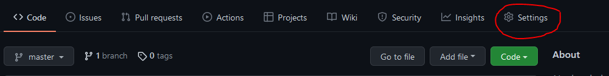
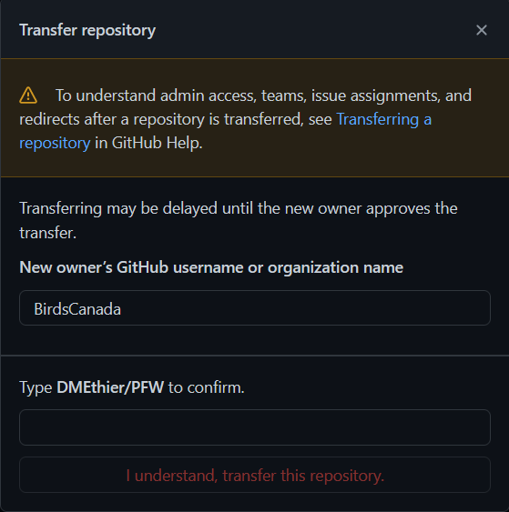

# Sharing GitHub Scripts {#Share6}


Now that you have mastered the basics of working with Git and GitHub using your preferred GUI you are ready to start collaborating (i.e., contribute to someones else's scripts). We will also walk you though how to transfer your repo to a new organization (e.g., Birds Canada) for long-term storage and management.

## Contributing code with RStudio {#Share6.1}

The idea of contributing code to someones repo can seem daunting at first. Let's keep it simple to start.

-   First, you will want to `Fork` the target repo to your own account. Navigate to your collaborator's GitHub page (e.g., [Birds Canada](https://github.com/BirdsCanada)), select the repo you want to work on, and use the `Fork` icon in the top right corner. Then select 'Create Fork'.


-   Now the repo will appear in your list of Repositories on your personal Github page. You can clone the repo to your local machine using the instructions previously provided for [RStudio](#RStud4.4).

-   Check out a new `branch` using the instructions previously provided in [Use branches to avoid heartache](#Best5.2). This will make a branch of your forked repo.

-   Once you're finished your edits, you will create a `pull request`. The difference now is that the repo owner will need to merge the pull request on their Github account. This gives them a chance to review your changes before merging them with the main branch.

Those are the basics to get you started.

## Transferring ownership {#Share6.2}

Once your code is fully developed and tested, it can be transferred to Birds Canada's Github account for future management.

**Why would you want to transfer ownership?**

By transferring the repository to Birds Canada, its content, issues, pull request, etc., can be administered without the need for your input moving forward. If you are a contractor, this makes sense since you may or many not be involved with future script development. If you are a regular employee, your scripts will be more accessible to other staff for collaborative development, and this ensures they are not lost if you move on to other projects or organizations.

> Note: You can still contribute to the scripts once transferred, and you will still be given credit for authorship (or co-authorship).

### Prerequisites for repository transfers {#Share6.2.1}

-   When you transfer a repository that you own to another user account, the new owner will receive a confirmation email. The confirmation email includes instructions for accepting the transfer. If the new owner doesn't accept the transfer within one day, the invitation will expire.

-   To transfer a repository that you own to an organization, you must have permission to create a repository in the target organization.

    <div>

    **If you are not yet a member of the Birds Canada organization on GitHub and need to transfer ownership of your code, please let me know and I will add you: [dethier\@birdscanada.org](mailto:dethier@birdscanada.org){.email}**

    </div>

-   The target account/organization must not have a repository with the same name, or a fork in the same network.

-   The original owner of the repository is added as a collaborator on the transferred repository. Other collaborators to the transferred repository remain intact.

-   Private forks can't be transferred (you must first make them public).

### Step-by-Step {#Share6.2.2}

1.  In your online GitHub account, navigate to the main page of the repository you wish to transfer.

2.  Once you have navigate to your repository, click Settings.



3.  Under the General tab, scroll to the very bottom labelled "Danger Zone". Click on Transfer Ownership.


4.  Read the information about transferring a repository, then type the name of the organization you'd like to transfer ownership to. In this instance you will type `BirdsCanada` (*all one word*), along with the name of the repository. You will be promoted to enter your Github password to complete the transfer.



5.  If you are part of the Birds Canada staff 'Team' on GitHub, you can click this box to allow other staff to access your scripts.

**You have now transferred ownership, but you also broken the connection between the GitHub repo and RStudio. Don't panic! We can fix this without needing to use the command line interface.**

Here is some sample R code for changing the origin of the repo from your personal GitHub account to Birds Canada.


```r
#load the library
library (usethis)

#look to see where RStudio is currently looking for the GitHub origin.
usethis::git_remotes()

#output example
#"https://github.com/DMEthier/BirdsCanada_GitHubGuide.git"

#Now redirect RStudio the new origin on the Birds Canada GitHub account

usethis::use_git_remote(
  "origin",
  "https://github.com/BirdsCanada/BirdsCanada_GitHubGuide.git",
  overwrite = TRUE
)
```

Whew! You have now fixed the broken link and can contribute your changes to the new origin.
