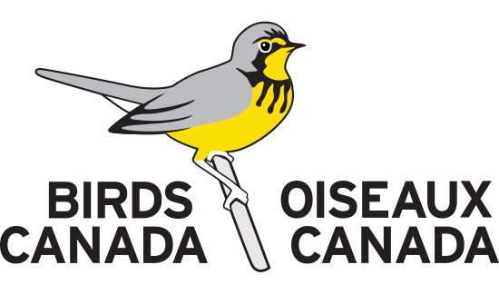

--- 
title: "R Code Annotation, Sharing, and Achieving with GitHub: A Beginners Guide"
author: "Danielle Ethier and Josh Sayers, Birds Canada"
date: "Version 1: March 2022"
site: bookdown::bookdown_site
documentclass: book
biblio-style: apalike
link-citations: yes
github-repo: DMEthier/BirdsCanada_RCodeArchiving
url: 'https://github.com/DMEthier/BirdsCanada_RCodeArchiving.git'
description: "Promoting R code annotation and achiving standards within Birds Canada"
cover-image: BirdsCan.PNG
---

# {-}

```{r coverimage, echo=FALSE, out.width="700px", fig.align='center'}

```


